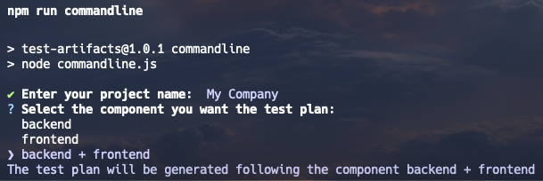
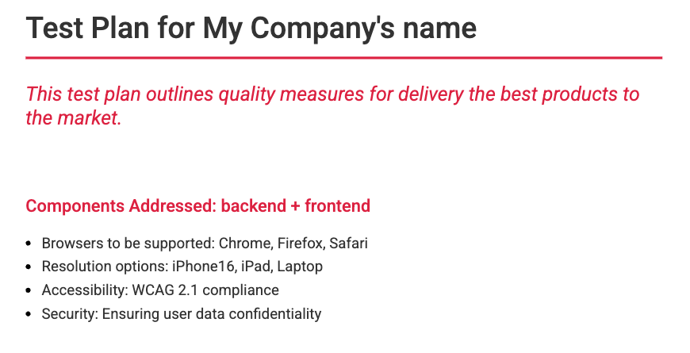

# test-artifacts


## Accelerate your testing process with efficient test artifacts generation tools.

Access our documentation to support you to get started:

* [Website Test Artifacts](https://test-artifacts.github.io/artifacts-test-site/)

* [View our projects on Github ](https://github.com/test-artifacts)

Assure you have installed nodeJS and npm:

https://nodejs.org/en/download/package-manager

Make sure you have those versions of nodeJS at least:

Node.js 20.x, 22.x and above (You may find some issues if you try an older version)

## If you want to run this project locally you need to clone the project: 

```
git clone https://github.com/test-artifacts/artifacts-test-generator.git
```


## In the root of the project you need to install dependecies:

```
npm install
```

## Test Artifacts Commandline Usage:

```
npm run commandline
```



The PDF will be generated in the root directory you ran the command

## Generate test plan as an example:

```
npm run pdf:example
```

The test plan will look like:




## For Client application whichs interacts with the browsers you can use the following example:

```
npm run pdf:example:client
```